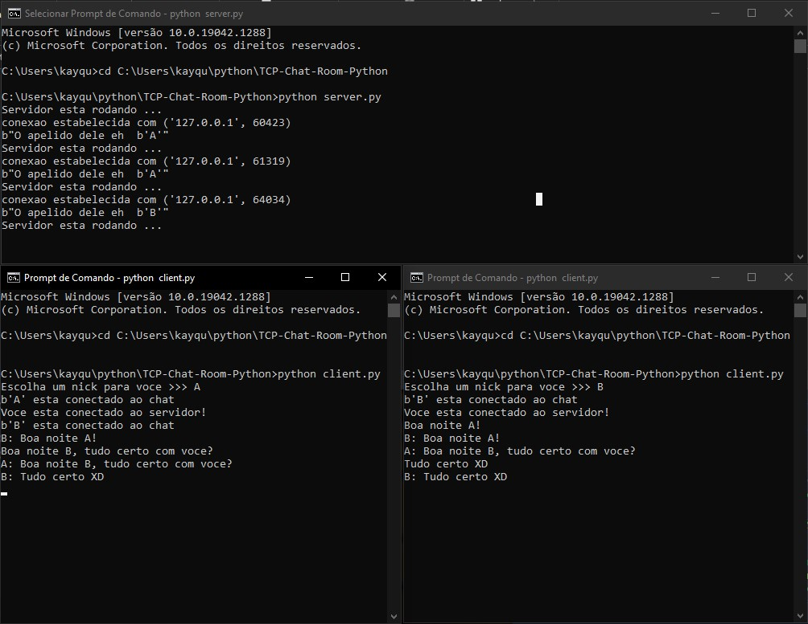

 
## Name_of_the_project
 
... Description
 
 
## Technology 
 
Here are the technologies used in this project.
 
* Ruby version  x.x.x
* Rails version x.x.x
* ...
 
 
## Services Used
 
* Github
* ...
 
 
## Ruby Gems
...
 
## Getting started
 
* To install gems:
>    $ bundle install
* To create the bank and do as migrations:
>    $ rake db:create db:migrate db:seed
* To run the project:
>    $ rails s
 
## How to use
 
Here will be the images and descriptions. Principal content.
 
 
## Features
 
  - Here will be the features.
 
 
## Links
 
  - Link of deployed application: (if has been deployed)
  - Repository: https://link_of_repository
    - In case of sensitive bugs like security vulnerabilities, please contact
      YOUR EMAIL directly instead of using issue tracker. We value your effort
      to improve the security and privacy of this project!
 
 
## Versioning
 
1.0.0.0
 
 
## Authors
 
* **YOUR NAME**: @YOUR_GITHUB_NICKNAME (https://github.com/YOUR_GITHUB_NICKNAME)
 
 
Please follow github and join us!
Thanks to visiting me and good coding!

<h1>TCP-Chat-Room</h1>

Um programa usando socket tcp, que funciona para comunicacao   de chat entre clientes que entram em um servidor.
<h2>Menu: (so clicar nos links)</h2>
<ul>
<li>Como utilizar?</li>
<li><a href="2">Protocolo da Camada da Aplicacao</a></li>
</ul>

<h2>Como utilizar?</h2>

O primeiro cmd eh o server, e os dois de baixo sao os clientes logados no server!!!

Primeiro passo eu abri tres cmds(Prompt de comando), para todos deve se localizar a pasta onde esta os arquivos server.py e client.py    (nesse caso eu copiei o endereco da pasta onde estava os arquivos e dei o comando "cd C:\Users\kayqu\python\TCP-Chat-Room-Python"),   em seguida ja estando na pasta, eh preciso primeiro abrir o arquivo server.py com o comando "python server.py no cmd", abrindo o servidor vc vai receber a mensagem "Servidor esta rodando ..."   agora eh abrir os clientes, entao para cada cmd de baixo eh so digitar o comando "python client.py", ai vc vai receber a mensagem "Escolha um nick para voce >>>",   logo depois de escolher o nick voce entrara no servidor, e quem ja estiver la vai receber uma mensagem dizendo que vc se conectou no servidor, e para voce vai aparecer a mensagem "Voce esta conectado ao servidor",   pronto agora eh so outro cliente se conectar da mesma forma que esse passo a passo e voces poderam conversar pelo servidor!!!

<h2 id="2">Protocolo da Camada da Aplicacao</h2>
