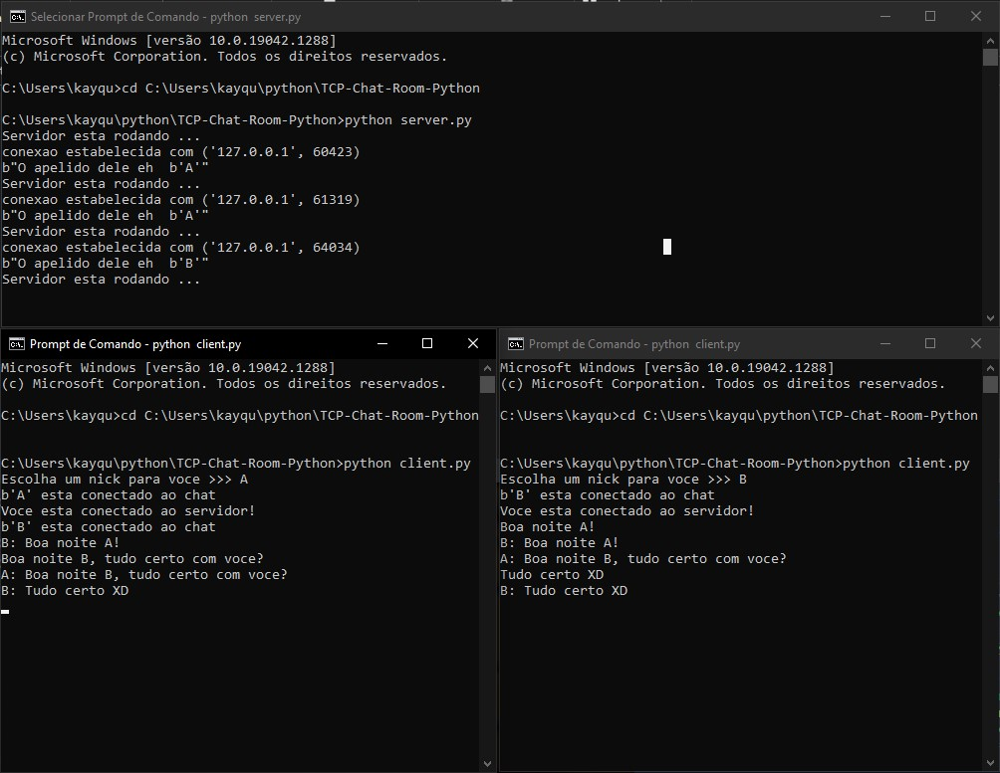
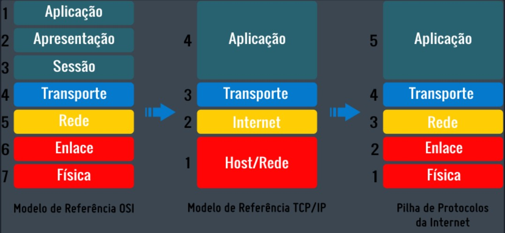

 
## TCP-Chat-Room
 
Um programa usando socket tcp, que funciona para comunicacao   de chat entre clientes que entram em um servidor.
 
 
## Tecnologias: 
 
Aqui estao as tecnologias usadas nesse projeto
 
* Python  3.9.5
* Prompt de comando
 
 
## Servicos usados:
 
* Github 

## Comecando:
 
* Primeiro rodar o arquivo server:
* Abrir o cmd e digitar:
>    cd endereco de onde esta a pasta
* Rodar o arquivo servidor:
>    python server.py
* Depois rodar o arquivo cliente:
>    python client.py
* Agora eh so abrir mais quantos clientes quiser e comecar a comunicacao
 
## Como utilizar:
 

* O primeiro cmd eh o server, e os dois de baixo sao os clientes logados no server!!!

* Primeiro passo eu abri tres cmds(Prompt de comando), para todos deve se localizar a pasta onde esta os arquivos server.py e client.py.  
* Nesse caso eu copiei o endereco da pasta onde estava os arquivos e dei o comando "cd C:\Users\kayqu\python\TCP-Chat-Room-Python"). 
* Em seguida ja estando na pasta, eh preciso primeiro abrir o arquivo server.py com o comando "python server.py no cmd", abrindo o servidor vc vai receber a mensagem "Servidor esta rodando ..." 
* Agora eh abrir os clientes, entao para cada cmd de baixo eh so digitar o comando "python client.py", ai vc vai receber a mensagem "Escolha um nick para voce >>>".
* Logo depois de escolher o nick voce entrara no servidor, e quem ja estiver la vai receber uma mensagem dizendo que vc se conectou no servidor, e para voce vai aparecer a mensagem "Voce esta conectado ao servidor".
* Pronto agora eh so outro cliente se conectar da mesma forma que esse passo a passo e voces poderam conversar pelo servidor!!!

 
 
## Protocolo da Aplicacao:

 
1.  O socket usado foi o tcp/ip pois possui suas funções divididas em camada da mesma forma que o OSI. A diferença principal nestas estruturas é o número de camadas encontradas em cada modelo: no OSI encontramos 7 camadas, enquanto no TCP/IP somente 4: Aplicação, Transporte, Rede e Interface de rede.

### 4. Camada Aplicação:
* Ela é responsável pela comunicação entre programas e os protocolos de transporte, além de também está presente definição da arquitetura do sistema, como cliente-servidor, P2P; O início do processo de envio de algo pela rede ocorre nessa camada.
* No nosso caso foi o cliente-servidor
* Existem vários protocolos nessa camada, mas um muito conhecido é o HTTP(port). A ideia dessa camada é encapsular os dados que serão enviadas acrescentado a eles um cabeçalho com informações como o protocolo e versão utilizados, tipo de conexão, linguagem.

### 3. Camada de Transporte
* Essa camada é responsável pela parte de comunicação entre aplicações que executam em hospedeiros (hosts) diferentes.
* Para ser mais específico, desempenha o papel de realizar a comunicação lógica entre os hospedeiros de forma que é responsável por garantir que os hospedeiros se comuniquem como se estivesse em uma mesma máquina, ou seja, é a camada responsável por criar garantias de que uma mensagem mensagem seja recebida por completa ou não.
* Os protocolos mais famosos nessa capada são o TCP e o UDP, usamos o TCP. 
* Também é nessa camada em que se fala em porta (port ou socket) que é uma interface que realiza a comunicação entre a camada de aplicação e transporte.
* A mensagem vinda da camada acima é encapsulada e dividida formando vários segmentos que são repassados para a camada de redes.
* codigo:
~~~python
 # No programa servidor:
 '''
 O que acontece no lado do servidor Web é um pouco mais complexo. Primeiro, o Servidor Web 
 cria um “soquete tipo servidor”:
 
 Algumas coisas que deves observar: usamos server.bind(('127.0.0.1', 80)) que eh soquete do 
 tipo “servidor”, mas esse so esta visível dentro do computador em que está sendo executado. 
 server.bind(('127.0.0.1', 80)) determina que o soquete estará acessível por qualquer computador 
 que possuas o endereço IP do computador.Ja o socket.gethostname() eh usado para que o soquete 
 esteja visível ao mundo exterior.

Uma segunda coisa que precisas observar é: as portas baixas, normalmente estão reservadas 
para serviços “bem conhecidos”, tais como (HTTP, SNMP etc). Como essa eh apenas uma atividade 
de redes, utilizei um número baixo (80).

Por fim, o argumento “listen” diz à biblioteca de soquetes que queremos enfileirar no máximo 
5 requisições de conexão (normalmente o máximo) antes de recusar começar a recusar conexões 
externas. Caso o resto do código esteja escrito corretamente, isso deverá ser o suficiente.

 
 '''
 import socket

 # setando o host ip e a porta http para o servidor rodar
 host = '127.0.0.1'
 port = 55555

 # configuracao do servidor

 # criando um servidor objeto
 server = socket.socket(socket.AF_INET, socket.SOCK_STREAM)
 # ligando(bind) o servidor ao host e a porta
 server.bind((host, port))
 '''para o cliente A mandar mensagem para o cliente B ele primeiro manda a 
 mensagem para o servidor que vai fazer esse intermediacao dessa comunicacao'''
 # ativar o modo de escuta para todas as conexões de entrada para o servidor
 server.listen()
 
 # No programa cliente:
 '''
Quando a connect (conexão) foi estabelecida, o soquete client pode ser utilizado para 
enviar uma solicitação de texto para a página. O mesmo soquete é que irá ler a resposta e, 
em seguida, o mesmo será destruído. Isso mesmo, será destruído. Os soquetes de Clientes 
normalmente são usados apenas numa única transação (troca) (ou um pequeno conjunto 
sequencial de transações).
 '''
 import socket

 # entrada do nick do cliente
 alias = input('Escolha um nick para voce >>> ')
 # criando um objeto cliente
 client = socket.socket(socket.AF_INET, socket.SOCK_STREAM)
 # conectando o cliente ao local host e a porta http respectivamente
 client.connect(('127.0.0.1', 55555))
~~~

### 2. Camada Rede
* A Camada de Rede, também conhecida como inter-redes, é responsável pela permissão de envio de pacotes por hosts a qualquer rede e pela garantia de que esses dados cheguem ao seu destino final. 
* Equivalente ao que é operacionalizado na camada de rede do modelo OSI, na arquitetura TCP/IP a camada de rede tem como embasamento os protocolos IP (Internet Protocol) e ICMP (Internet Control Message Protocol).
* codigo:
~~~python
# No programa servidor
# Funcao que manda mensagem do servidor para todos clientes conectados
def broadcast(msg):
    # iremos iterar através da lista de clientes, e para cada cliente enviamos esta mensagem
    for client in clients:
        client.send(msg)

# Funcao para cuidar de cada conexao de cada cliente
def handle_client(client):
    while True:
        try:  # mensagem vai ser igual a mensagem recebida do cliente
            msg = client.recv(1024)
            '''se a mensagem for recebida com sucesso do cliente, a funcao broadcast para 
            mandar essa mensagem para todos os outros clientes '''
            broadcast(msg)
        except:
            ''' em caso de falhas ou erros de conexao, precisamos identificar o cliente que 
            iremos derrubar da lista de clientes e do servidor '''
            # o index vai achar a tupla no nosso caso o cliente
            index = clients.index(client)
            # remocao do cliente da lista de clientes
            clients.remove(client)
            # encerra a conexao do cliente com o servidor
            client.close()
            # fazendo a mesma coisa para o apelido do cliente
            alias = aliases[index]
            # avisa ao servidor que o cliente de tal nickname acabou de sair do servidor
            broadcast(f'{alias} acabou de sair do chat!'.encode('utf-8'))
            # remove o nick da lista de nicks
            aliases.remove(alias)
            # quebra o loop
            break
~~~

### 1. Camada Interface de Rede
* Esta é a camada de base da arquitetura TCP/IP, correspondente às camadas de enlace de dados e física do OSI, onde ocorre a conexão básica do host com a rede por meio de algum protocolo capaz de enviar pacotes IP. 
* É por meio desta camada que é possível transmitir dados a outros computadores dentro de uma mesma rede física, além de realizar o envio do datagrama recebido pela camada de internet através de meios físicos.
* Para se manter em funcionamento a camada de Interface de rede utiliza como principais protocolos: Ethernet para Redes Locais (LAN – Local Area Network) e PPP (Point-to-Point Protocol) para Redes de Longa Distância (WAN – Wide Area Network).
* Usamos LAN nesse caso ja que estamos num mesmo computador
* codigo:
~~~python
# Programa servidor
# Funcao principal para receber a conexao dos clientes
def receive():
    while True:
        print('Servidor esta rodando ...')
        client, address = server.accept()
        print(f'conexao estabelecida com {str(address)}')
        client.send('alias?'.encode('utf-8'))
        alias = client.recv(1024)
        # acrescentando o apelido a lista de apelidos
        aliases.append(alias)
        # acrescentando o cliente a lista de clientes
        clients.append(client)
        # mostrar mensangem retornando ao cliente qual eh o apelido dele
        print(f'O apelido dele eh  {alias}'.encode('utf-8'))
        # usar a funcao broadcast para mostrar a todos os clientes online que esse cliente entrou no chat room
        broadcast(f'{alias} esta conectado ao chat'.encode('utf-8'))
        # mandar uma mensagem do servidor para esse cliente falando que agora ele esta conectado
        client.send('Voce esta conectado ao servidor!'.encode('utf-8'))

        """ criando e startando a thread(tarefa) objeto que vai ser responsavel por rodar uma 
            thread individual para cada cliente de forma que as threads funcionem ao mesmo tempo
            dessa forma quando o cliente A, mandar mensagem para o cliente B, a comunicacao acontecera
            instantaneamente gracas a esse recurso chamado multi threading do python"""

        thread = threading.Thread(target=handle_client, args=(client,))
        thread.start()

if __name__ == "__main__":
    receive()
    
# Programa cliente
"""Criar duas funcoes para duas tarefas(threads), uma para receber mensagens de 
outros clientes pelo servidor, e a outra funcao para enviar mensagens para outros 
clientes pelo servidor! """

# funcao para receber mensagens de outros clientes pelo servidor
def client_receive():
    while True:
        try:
            msg = client.recv(1024).decode('utf-8')
            # se a msg for igual a 'alias?' que foi definido la no server.py
            if msg == 'alias?':
                client.send(alias.encode('utf-8'))
            else:
                print(msg)
        except:
            print('Error!')
            client.close()
            break

# funcao para enviar mensagens para outros clientes pelo servidor
def client_send():
    while True:
        # como vai ficar a mensagem (seunick: mensagem que digitou)
        msg = f'{alias}: {input("")}'
        # mandando a mensagem
        client.send(msg.encode('utf-8'))

""" Criando e startando duas threads(tarefas), uma para receber mensagens 
e uma para enviar mensagens"""
receive_thread = threading.Thread(target=client_receive)
receive_thread.start()

send_thread = threading.Thread(target=client_send)
send_thread.start()
~~~

## Funcionamento do software:
1. Proposito do software:
* Gerar uma comunicacao de dois clientes ou mais atraves, de um chat, por intermedio de um servidor
2. Motivacao da escolha do software:
* Minha motivacao pra fazer o projeto foi pelo simplicidade de codigo porem com um peso maior de conhecimento sobre os assuntos relacionados ao protocolo tcp entre outros conhecimentos da propria materia de redes.
3. Motivacao da escolha do protocolo TCP/IP:
* O protocolo UDP (sigla para User Datagram Protocol) tem, como característica essencial, um atributo que pode parecer esquisito para os iniciantes no tema - a falta de confiabilidade.
* Para nosso caso eh essencial a confiabilidade pois Entendendo o UDP, fica claro nosso problema - a falta de confiabilidade dele fez com que as mensagens trocadas pelo bate-papo se corrompessem de diversas formas!
* Entao a melhor alternativa para o Chat-room foi o TCP pois ele é voltado à conexão e tem como garantia a integridade e ordem de todos os dados.
* O nome SYN,SYN-ACK,ACK é uma resumida descrição de como esse handshake funciona. A conexão entre dois hosts começa com o primeiro enviando ao segundo um pacote de sincronização (SYNchronize).
* O segundo host recebe esse pacote e responde com a confirmação do sincronização (SYNchronize-ACKnowledgment). O primeiro host, por fim, manda uma confirmação (ACKnowledge) para o segundo, assim estabelecendo a conexão.
* Com o TCP, de fato temos uma conexão entre um ponto e outro, comumente chamados de servidor e cliente. É interessante notar que o TCP permite o envio simultâneo de dados de ambos os pontos ao outro, durante todo o fluxo de comunicação.
* Desse modo, o TCP é ideal para casos em que a confiabilidade dos dados é essencial, como quando se trata de mensagens de texto! 
4. Requisitos minimos de funcionamento:
* Sistema operacional: Windows 7, Mac OS X 10.9, Linux distribuição de 2014 ou mais recentes
* Processador: Intel Celeron J4105 ou AMD FX-4100 ou superiores
* Memória RAM: 4 GB ou superior

 
## Links
 
  - Repository: https://https://github.com/Kaymoreira/TCP-Chat-Room
    - Em caso de bugs sensíveis, como vulnerabilidades de segurança, por favor entre em contato:
      kayque221023@gmail.com, diretamente em vez de usar o rastreador de problemas. Nós valorizamos seu esforço
      para melhorar a segurança e privacidade deste projeto!
 
 
## Versão
 
1.0.0.0
 
 
## Autor
 
* **KAYQUE MOREIRA**: @Kaymoreira (https://github.com/Kaymoreira)
 
 
Por favor, siga o meu github 😁! 

Obrigado por me visitar e boa codificação 😎!

